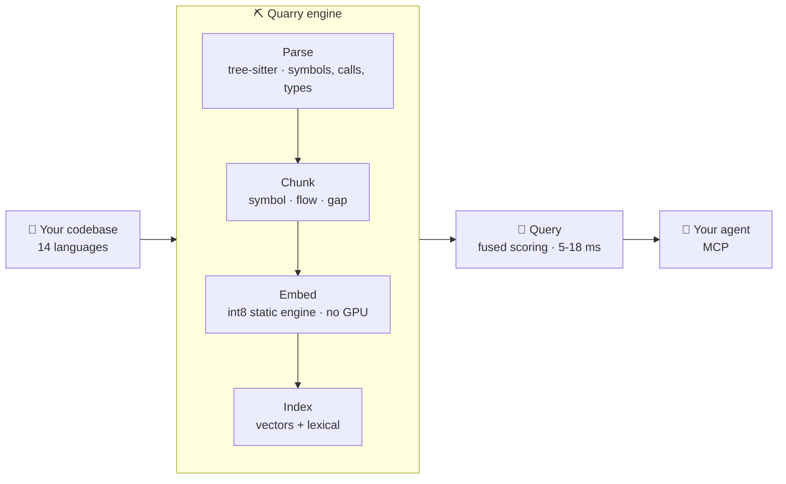

<div align="center">

<h1>Quarry ⛏</h1>

<p><b>Your coding agent shouldn't have to grep.</b></p>

<p>Ask in plain English. Get the right file in <b>6 ms</b>. On your machine, from a 31 MB model.</p>

<p>
  <a href="https://github.com/sait-turanalp/quarry/releases"></a>
  <a href="LICENSE"></a>
  
  
  
</p>

<p>
  
  
</p>

<p>
  <a href="#install-into-your-agent">Install</a> •
  <a href="#the-numbers">Numbers</a> •
  <a href="#how-it-works">How it works</a> •
  <a href="#how-the-numbers-were-measured">Methodology</a> •
  <a href="#honest-limitations">Limitations</a> •
  <a href="#license">License</a>
</p>

</div>

Your agent does not know where anything is. So it greps, reads the wrong file, greps again with different words, and burns a third of its context window before it writes a line of code. Every one of those round trips is a wrong guess about *where*.

Quarry answers *where*. It is a local **code retrieval engine**: a tree-sitter parser for 14 languages, a custom int8 embedding engine, a lexical index and a scoring layer in one binary, reachable over [MCP](https://modelcontextprotocol.io), returning ranked, line-ranged snippets in single-digit milliseconds, entirely offline.

Ask it the way you would ask a colleague:

```console
$ quarry mcp semantic_search_chunks query:"break a name written in camelCase into separate words"

   File: ./examples/go/app/utils/helper.go:335       Scope: capitalizeWords
   File: ./src/mcp/mod.rs:4467-4484                  Scope: extract_keywords_from_symbols
   File: ./src/utils.rs:16-49                        ← split_identifier(), the answer
```

Not one word of that question appears in `split_identifier`. Grep cannot get there from here. `rg -i "camelcase"` returns 2 unrelated lines, `rg -i "split.*word"` returns 8. Quarry puts the answer third in a list you read in one glance.

That is the honest shape of the promise: **not always first, but almost always in the list.** Measured, it is in the first twenty results 83% of the time.

## Install into your agent

<details open>
<summary><b>Claude Code</b>: one command</summary>

```bash
brew install sait-turanalp/quarry/quarry
cd your-project && quarry init && quarry index .

claude mcp add quarry -- quarry serve
```

That is it. Ask Claude Code *"where do we validate the auth token?"* and it will call Quarry instead of grepping.
</details>

<details>
<summary><b>Codex</b>: one config block</summary>

```bash
brew install sait-turanalp/quarry/quarry
cd your-project && quarry init && quarry index .
```

Then add to `~/.codex/config.toml`:

```toml
[mcp_servers.quarry]
command = "quarry"
args = ["serve"]
```
</details>

Any other MCP client works the same way: the server is `quarry serve` over stdio, or `quarry serve --http` if you need a socket.

## The numbers

Measured on four real repositories in four languages, with **1376 queries**, leakage-free ground truth, an identical output budget of 20 files for every contender.

| | **Quarry** | ripgrep |
|---|:---:|:---:|
| **Right file found (R@20)** | **83.4%** | 69.2% |
| Right file in the top 10 | **76.5%** | 57.6% |
| Median query latency | **5-18 ms** | 67-348 ms |
| Misses | **1 in 6** | 1 in 3 |

**Quarry finds the file ripgrep misses, roughly 20× faster.** Per repository:

| repository | language | **Quarry R@20** | ripgrep R@20 | Quarry p50 |
|---|---|:---:|:---:|:---:|
| django | Python | **86.0%** | 68.7% | 18 ms |
| tokio | Rust | **84.9%** | 75.4% | 5 ms |
| vite | TypeScript | **84.1%** | 66.1% | 5 ms |
| hugo | Go | **78.5%** | 66.5% | 7 ms |

Not one of those numbers involves a network call, an API key or a GPU.

### Why this matters more for an agent than for you

You can afford a bad grep. You squint at 200 matches, spot the right one, move on. It cost you four seconds.

An agent pays differently. A wrong retrieval is a wrong file *read into the context window*, then another search, then another read. Three failed round trips is thousands of tokens spent, a diluted context, and a worse answer at the end, and the agent cannot tell that it went wrong, because it never saw the file it needed.

Cutting the miss rate from **1 in 3 to 1 in 6** is not a 14-point improvement on a chart. It halves how often the loop starts.

## Why this exists

Code search forces a choice today. **grep** is instant, local and private, but it only finds what is literally written, so it misses whenever your words and the code's words differ. **Cloud embeddings** understand meaning, but your source leaves the machine, every query costs money and latency, and the index sits behind an API.

The obvious third option, *semantic search at grep speed, entirely local*, stayed unbuilt for a boring reason: a transformer embedding costs roughly **700 ms per chunk on a CPU**. Multiply that by a candidate pool and the idea dies before it starts.

Quarry's answer is the part it owns: **an int8 static embedding engine**. The embedding table stays in native int8 at runtime, 31 MB instead of 123 MB, accumulating in i32 with autovectorised kernels and rayon-parallel batching. No transformer forward pass, no GPU, no network. That is what turns a 700 ms idea into a 6 ms one.

## Features

- 🔍 **Finds meaning, not strings**: ask in your own words; Quarry matches on what the code *does*, not on whether you guessed the identifier.
- ⚡ **Grep speed, locally**: 5-18 ms per query on a laptop CPU, because the embedding engine never runs a transformer.
- 🔒 **Nothing leaves the machine**: no API key, no telemetry, no upload. Works on a plane.
- 🤖 **Built for agents**: an MCP server exposing semantic search, call graphs, callers, impact analysis, type fields and source retrieval.
- 🌍 **14 languages**: Rust, Python, TypeScript, JavaScript, Go, Java, C, C++, C#, PHP, Kotlin, Swift, Lua, GDScript.
- 🧭 **More than search**: tree-sitter gives it real structure, so it also answers *who calls this*, *what breaks if I change it*, *what does this module export*.
- 📦 **One binary**: engine, index and MCP server ship together. Nothing to orchestrate.

## Usage

```text
quarry init                    # write .quarry/settings.toml
quarry index <path>            # build the index
quarry index <path> --force    # rebuild it from scratch
quarry serve                   # MCP server (stdio)
quarry serve --http --watch    # MCP over HTTP, live re-index on change
quarry mcp <tool> k:v ...      # call any tool straight from the shell
quarry retrieve <query>        # symbols, callers, dependencies
quarry parse <file>            # dump the AST, for parser work
```

<details>
<summary>Other install routes</summary>

```bash
# prebuilt binaries
#   https://github.com/sait-turanalp/quarry/releases

# from source (Rust 1.85+)
cargo install --git https://github.com/sait-turanalp/quarry
```
</details>

## How it works

Quarry is one **engine**, not a pipeline you assemble. Source goes in; ranked, line-ranged snippets come out.



At query time the question is embedded once, scored against the vector index and a lexical index, the two fused on normalised scores, and files ranked by the evidence their chunks carry. One chunk per file, so twenty results mean twenty *distinct* files rather than twenty views of the same one.

**Built on** the open pieces worth building on: [tree-sitter](https://tree-sitter.github.io) for parsing, [Tantivy](https://github.com/quickwit-oss/tantivy) for the lexical index, [model2vec](https://github.com/MinishLab/model2vec) static embeddings quantised to int8. The part Quarry owns is the retrieval engine above them, the int8 runtime and the chunking and the scoring, and every default in it earned its place through the benchmark below.

## How the numbers were measured

Retrieval claims are cheap, so here is exactly how these were produced. The harness lives in [`benchmarks/retrieval/`](benchmarks/retrieval/) and anyone can re-run it.

- **Ground truth comes from git history.** A commit message is the query; the files that commit changed are the answer. Nobody hand-picked a favourable set.
- **No leakage.** The index is built from the *parent* commit, so the code being searched has not yet been touched by the commit that produced the query.
- **Four repositories, four languages**: django, tokio, vite, hugo. 1376 queries, after verifying that every expected file is genuinely in the index.
- **Identical budget.** Every contender returns the same 20 files. A method that "wins" by returning more results is not winning.
- **Paired comparisons.** Wins and losses are counted per query; a mean difference alone is never enough. The noise floor is ±0.016, so anything under 0.05 is treated as noise and rejected.

This is a deliberately *hard* benchmark. A commit message like `Fixed #12345 -- Refactored qs.delete()` is far less descriptive than what a developer or an agent actually types, so real queries should do better than the table above, not worse.

The same harness is why the roadmap is short: learned ranking weights, call-graph features, late interaction, multi-step retrieval, LLM query rewriting and a 161M-parameter code transformer were all built, measured, and **rejected** for not clearing the bar. Those verdicts are written down in [`docs/plans/retrieval-tuning.md`](docs/plans/retrieval-tuning.md).

## Requirements

- macOS or Linux, 64-bit (developed and measured on Apple Silicon; Windows is untested)
- ~31 MB on disk for the int8 embedding model, plus roughly 100 bytes per indexed symbol
- Rust 1.85+ only if you build from source (Linux also needs `pkg-config`, `libssl-dev`)
- No GPU, no network, no API key at runtime

## Honest limitations

- **The top 10 has a ceiling.** Recall is 83% at 20 results and 76% at 10, and measurement puts the practical limit of ranking alone near 81%. About 10% of benchmark queries are not discriminative enough to identify any file, and no ranker fixes those.
- **The lexical arm currently earns little.** Ablations put the engine at 83.5% on the dense signal alone against 83.4% fused. It stays because exact-symbol queries are under-represented in a commit-message benchmark, but it is not carrying the result and this README will not pretend otherwise.
- **Grep is still right sometimes.** When you know the exact string and want every occurrence, use grep. It is exhaustive and Quarry is ranked. Quarry is for when you know the intent and not the name.
- **The index is a snapshot.** New and changed files need `quarry index` again, or `serve --watch` to do it for you.
- **Four repositories is four repositories.** Real code in four languages, but your codebase may sit outside that spread.
- **Latency scales with corpus size.** 5 ms on a 100K-line project, 18 ms on a 350K-line one, still far below anything involving a network.

## Roadmap

- File-level identity from real parsed symbols (a regex proxy measured +0.022; the parser should do better)
- A compact "also considered" tail, so an agent can see 50 candidates for the token cost of about 12
- Incremental index updates without a full re-walk
- Windows support

## Contributing

Contributions welcome, see [CONTRIBUTING.md](CONTRIBUTING.md).

Anything touching retrieval quality has one rule: measure it with `benchmarks/retrieval/` before it ships, and write the verdict, *including* the rejections, into [`docs/plans/retrieval-tuning.md`](docs/plans/retrieval-tuning.md). Most good-sounding ideas lose. That document exists so nobody has to lose to them twice.

## Credits

Built on [codanna](https://github.com/bartolli/codanna) by Angel Bartolli, Apache-2.0. See [NOTICE](NOTICE).

## License

[Apache-2.0](LICENSE)
