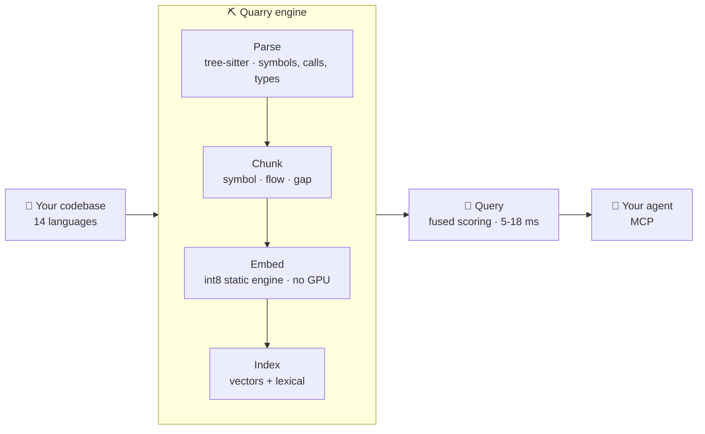

<div align="center">

<h1>Quarry ⛏</h1>

<p><b>The code intelligence engine for AI coding agents.</b></p>

<p>Your agent is only as good as what it can find. Quarry gives it a real map of your codebase, and keeps that map on your machine.</p>

<p><b>Your agent stops reading files it does not need: 99.4% fewer tokens than grep and read.</b></p>

<p><b>And when it searches, its misses drop from 1 in 3 to 1 in 6.</b></p>

<p><i>2.6× the accuracy of lexical search. Nothing leaves the machine.</i></p>

<p>
  <a href="LICENSE"></a>
  
  
  
  
</p>

<p>
  
  
</p>

<p>
  <a href="#install-into-your-agent">Install</a> •
  <a href="#the-numbers">Numbers</a> •
  <a href="#how-it-works">How it works</a> •
  <a href="#how-the-numbers-were-measured">Methodology</a> •
  <a href="#honest-limitations">Limitations</a> •
  <a href="#license">License</a>
</p>

</div>

Coding agents have become the way most software gets written. They are also blind. Dropped into a codebase they have never seen, they grep, read the wrong file, grep again with different words, and spend a third of their context window guessing at *where* before they write a line of code.

The industry's answer has been to upload your source to someone else's machine and embed it there. Quarry's answer is that you should not have to.

It is a **code intelligence engine** that runs where your code already lives. It parses fourteen languages the way a compiler does, understands what the code means rather than how it is spelled, and answers over [MCP](https://modelcontextprotocol.io) faster than you can finish reading the question. No API key. No upload. No account.

<p align="center">
  
</p>

Ask it the way you would ask a colleague:

<p align="center">
  
</p>

That is Django, half a million lines, and the question is not a search query. The file it lands on is the validator that implements the rule.

It does not always land first. Here is one where it does not:

```console
$ quarry search "break a camelCase name into words"

examples/go/app/utils/helper.go:334-334  capitalizeWords
src/mcp/mod.rs:4466-4483                 extract_keywords_from_symbols
src/utils.rs:15-48                       ← split_identifier(), the answer
```

Third, not first. Grep does not get there at all: `rg -i "camelcase"` returns 2 unrelated lines, `rg -i "split.*word"` returns 8, and none of them is the function.

That is the honest shape of the promise: **not always first, but almost always in the list.** Measured, it is in the first twenty results 83% of the time.

## Install into your agent

<details open>
<summary><b>Claude Code</b>: a plugin</summary>

```bash
brew install sait-turanalp/quarry/quarry
```

Then, inside Claude Code:

```
/plugin marketplace add sait-turanalp/quarry
/plugin install quarry
/quarry-index
```

The plugin registers the MCP server, and installs a skill that tells the agent which of the seventeen tools answers which question — and where grep is still the better instrument. `/quarry-index` builds the index for whichever project you are in.

Ask Claude Code *"where do we validate the auth token?"* and it calls Quarry instead of grepping.

Prefer to wire it up yourself: `claude mcp add quarry -- quarry serve`, then `quarry init && quarry index .` in the project.
</details>

<details>
<summary><b>Codex</b>: one config block</summary>

```bash
brew install sait-turanalp/quarry/quarry
cd your-project && quarry init && quarry index .
```

Then add to `~/.codex/config.toml`:

```toml
[mcp_servers.quarry]
command = "quarry"
args = ["serve"]
```
</details>

Any other MCP client works the same way: the server is `quarry serve` over stdio, or `quarry serve --http` if you need a socket.

The index is a snapshot of the code as it was when you built it. `quarry serve --watch` keeps it current as files change.

## The numbers

Measured on four real repositories in four languages, with **1376 queries**, leakage-free ground truth, an identical output budget of 20 files for every contender.

### What the answer costs

An agent's scarcest resource is its context window, and grep spends it on files that turn out to be wrong. Median tokens spent by the time the wanted file is in hand, counted with tiktoken rather than estimated:

| | tokens | vs Quarry |
|---|---:|---:|
| **Quarry**, one call | **108** | |
| grep, then read the ranked files | 30,454 | **99.6% more** |
| grep, then read 20 lines around each match | 18,047 | **99.4% more** |

The third row is the one to argue with, and it is the one that matters: it is grep already doing the smart thing, reading only around its matches, and it still costs about 170× as much. A query counts only when both methods found the file, so grep is never charged for a search that never ended. Method, baseline and raw per-query numbers: [`benchmarks/tokens/`](benchmarks/tokens/).

### How often it is right

<p align="center">
  
</p>

| | **Quarry** | ripgrep | BM25 only |
|---|:---:|:---:|:---:|
| **Right file found (R@20)** | **83.4%** | 69.2% | 31.5% |
| Right file in the top 10 | **76.5%** | 57.6% | 17.9% |
| Median query latency | **5-18 ms** | 67-348 ms | 5-18 ms |
| Misses | **1 in 6** | 1 in 3 | 2 in 3 |

**Quarry finds the file ripgrep misses, and more than doubles what lexical ranking alone can reach.**

The latency comparison is not symmetric, so read it for what it is: Quarry answers in 5-18 ms against a prebuilt index, where ripgrep re-scans the corpus in 67-348 ms. Building that index is a real cost paid once; an agent then spends it back over hundreds of queries in a session.

Per repository:

<p align="center">
  
</p>

| repository | language | **Quarry R@20** | ripgrep R@20 | Quarry p50 |
|---|---|:---:|:---:|:---:|
| django | Python | **86.0%** | 68.7% | 18 ms |
| tokio | Rust | **84.9%** | 75.4% | 5 ms |
| vite | TypeScript | **84.1%** | 66.1% | 5 ms |
| hugo | Go | **78.5%** | 66.5% | 7 ms |

Not one of those numbers involves a network call, an API key or a GPU.

### Indexing a real codebase

The reason local semantic search stayed theoretical is not quality, it is the index. Embedding a large repository with a transformer on a CPU takes hours, so the practical advice became "send it to a server". Measured on the same laptop, a MacBook Air M2 (4 performance cores, 4 efficiency cores, 16 GB), against Django:

<p align="center">
  
</p>

| 502,537 lines · 2,986 files · 250,506 chunks | time | what it buys |
|---|---|---|
| **Quarry**, complete index | **19 seconds** | the baseline |
| jina-v2-base-code on the same CPU, embedding only | ~47 hours *(measured at 1.5 chunks/s)* | **+2.5 points of R@10** when it reranks Quarry's own candidates |

That last cell is the whole trade, and it is not in Quarry's favour on quality: the transformer is the better embedder in isolation. It costs four orders of magnitude to find out.

The comparison is deliberately generous to the transformer everywhere else: Quarry's figure covers parsing, chunking, embedding and writing the whole index, while the other covers embedding alone. A GPU would close much of the time gap, and there is no GPU number here because none was measured.

### Why this matters more for an agent than for you

You can afford a bad grep. You squint at 200 matches, spot the right one, move on. It cost you four seconds.

An agent pays differently. A wrong retrieval is a wrong file *read into the context window*, then another search, then another read. Three failed round trips is thousands of tokens spent, a diluted context, and a worse answer at the end, and the agent cannot tell that it went wrong, because it never saw the file it needed.

Cutting the miss rate from **1 in 3 to 1 in 6** is not a 14-point improvement on a chart. It halves how often the loop starts.

## Why this exists

Code search forces a choice today. **grep** is instant, local and private, but it only finds what is literally written, so it misses whenever your words and the code's words differ. **Cloud embeddings** understand meaning, but your source leaves the machine, every query costs money and latency, and the index sits behind an API.

The obvious third option, *semantic search at grep speed, entirely local*, stayed unbuilt for a boring reason: a transformer embedding costs roughly **700 ms per chunk on a CPU**. Multiply that by a candidate pool and the idea dies before it starts.

Quarry's answer is the part it owns: **an int8 static embedding engine**. The embedding table stays in native int8 at runtime, 31 MB instead of 123 MB, accumulating in i32 with autovectorised kernels and rayon-parallel batching. No transformer forward pass, no GPU, no network. That is what turns a 700 ms idea into a 6 ms one.

## Features

- 🔍 **Finds meaning, not strings**: ask in your own words; Quarry matches on what the code *does*, not on whether you guessed the identifier.
- ⚡ **Grep speed, locally**: 5-18 ms per query on a laptop CPU, because the embedding engine never runs a transformer.
- 🔒 **Nothing leaves the machine**: no API key, no telemetry, no upload. Works on a plane.
- 🤖 **Built for agents**: an MCP server exposing semantic search, call graphs, callers, impact analysis, type fields and source retrieval.
- 🌍 **14 languages**: Rust, Python, TypeScript, JavaScript, Go, Java, C, C++, C#, PHP, Kotlin, Swift, Lua, GDScript.
- 🧭 **More than search**: tree-sitter gives it real structure, so it also answers *who calls this*, *what breaks if I change it*, *what does this module export*.
- 📦 **One binary**: engine, index, model and MCP server ship together. Nothing to fetch, nothing to orchestrate.

## What your agent can ask

Search is one of seventeen tools. The rest exist because half of an agent's questions are not "where is this" but "what happens if I touch it".

| tool | the question it answers |
|---|---|
| `search` / `semantic_search_chunks` | Where is the code that does *this*? |
| `semantic_search_docs` | Which symbol is this, by what it does? |
| `semantic_search_with_context` | Same, plus docs, callers and impact in one call |
| `search_symbols` | Full-text symbol lookup with fuzzy matching |
| `find_symbol` | Where is this exact name defined? |
| `get_source` | Show me the actual code for it |
| `find_callers` | What calls this? |
| `get_calls` | What does this call? |
| `get_call_tree` | The whole downstream tree, with depth |
| `analyze_impact` | What breaks if I change this? |
| `get_type_fields` | What are this type's fields and methods? |
| `get_module_exports` | What is public in this file? |
| `get_feature_context` | Everything about one symbol, in a single call |
| `get_project_overview` | Architecture, tech stack, module relationships |
| `get_state_graph` | React hooks in a component: state, effects, callbacks |
| `search_documents` | The same search over markdown and docs |
| `get_index_info` | What is indexed, and how much of it |

An agent that can ask *what breaks if I change this* before editing is a different kind of agent from one that can only grep.

## Usage

```text
quarry init                    # write .quarry/settings.toml
quarry index <path>            # build the index
quarry index <path> --force    # rebuild it from scratch
quarry search "<question>"     # ask in plain English (--limit, --lang, --json)
quarry serve                   # MCP server (stdio)
quarry serve --http --watch    # MCP over HTTP, live re-index on change
quarry mcp <tool> k:v ...      # call any of the seventeen tools from the shell
quarry retrieve <query>        # symbols, callers, dependencies
quarry parse <file>            # dump the AST, for parser work
```

<details>
<summary>Other install routes</summary>

```bash
# prebuilt binaries
#   https://github.com/sait-turanalp/quarry/releases

# from source (Rust 1.85+)
cargo install --git https://github.com/sait-turanalp/quarry
```
</details>

## How it works

Quarry is one **engine**, not a pipeline you assemble. Source goes in; ranked, line-ranged snippets come out.



At query time the question is embedded once, scored against the vector index and a lexical index, the two fused on normalised scores, and files ranked by the evidence their chunks carry. One chunk per file, so twenty results mean twenty *distinct* files rather than twenty views of the same one.

**Built on** the open pieces worth building on: [tree-sitter](https://tree-sitter.github.io) for parsing, [Tantivy](https://github.com/quickwit-oss/tantivy) for the lexical index, [model2vec](https://github.com/MinishLab/model2vec) static embeddings quantised to int8. The part Quarry owns is the retrieval engine above them, the int8 runtime and the chunking and the scoring, and every default in it earned its place through the benchmark below.

## How the numbers were measured

Retrieval claims are cheap, so here is exactly how these were produced. The harness lives in [`benchmarks/retrieval/`](benchmarks/retrieval/) and anyone can re-run it.

- **Ground truth comes from git history.** A commit message is the query; the files that commit changed are the answer. Nobody hand-picked a favourable set.
- **No leakage.** The index is built from the *parent* commit, so the code being searched has not yet been touched by the commit that produced the query.
- **Four repositories, four languages**: django, tokio, vite, hugo. 1376 queries, after verifying that every expected file is genuinely in the index.
- **Identical budget.** Every contender returns the same 20 files. A method that "wins" by returning more results is not winning.
- **Paired comparisons.** Wins and losses are counted per query; a mean difference alone is never enough. The noise floor is ±0.016, so anything under 0.05 is treated as noise and rejected.

This is a deliberately *hard* benchmark. A commit message like `Fixed #12345 -- Refactored qs.delete()` is far less descriptive than what a developer or an agent actually types, so real queries should do better than the table above, not worse.

The same harness is why the roadmap is short: learned ranking weights, call-graph features, late interaction, multi-step retrieval, LLM query rewriting and a 161M-parameter code transformer were all built, measured, and **rejected** for not clearing the bar. Those verdicts are written down in [`docs/plans/retrieval-tuning.md`](docs/plans/retrieval-tuning.md).

## Requirements

- macOS or Linux, 64-bit (developed and measured on Apple Silicon; Windows is untested)
- ~31 MB on disk for the int8 embedding model, plus roughly 100 bytes per indexed symbol
- Rust 1.85+ only if you build from source (Linux also needs `pkg-config`, `libssl-dev`)
- No GPU, no network, no API key at runtime

## Honest limitations

- **The top 10 has a ceiling.** Recall is 83% at 20 results and 76% at 10, and measurement puts the practical limit of ranking alone near 81%. About 10% of benchmark queries are not discriminative enough to identify any file, and no ranker fixes those.
- **The lexical arm currently earns little.** Ablations put the engine at 83.5% on the dense signal alone against 83.4% fused. It stays because exact-symbol queries are under-represented in a commit-message benchmark, but it is not carrying the result and this README will not pretend otherwise.
- **Grep is still right sometimes.** When you know the exact string and want every occurrence, use grep. It is exhaustive and Quarry is ranked. Quarry is for when you know the intent and not the name.
- **The index is a snapshot.** New and changed files need `quarry index` again, or `serve --watch` to do it for you.
- **Four repositories is four repositories.** Real code in four languages, but your codebase may sit outside that spread.
- **Latency scales with corpus size.** 5 ms on a 100K-line project, 18 ms on a 350K-line one, still far below anything involving a network.

## Roadmap

- File-level identity from real parsed symbols (a regex proxy measured +0.022; the parser should do better)
- A compact "also considered" tail, so an agent can see 50 candidates for the token cost of about 12
- Incremental index updates without a full re-walk
- Windows support

## Contributing

Contributions welcome, see [CONTRIBUTING.md](CONTRIBUTING.md).

Anything touching retrieval quality has one rule: measure it with `benchmarks/retrieval/` before it ships, and write the verdict, *including* the rejections, into [`docs/plans/retrieval-tuning.md`](docs/plans/retrieval-tuning.md). Most good-sounding ideas lose. That document exists so nobody has to lose to them twice.

## Credits

Built on [codanna](https://github.com/bartolli/codanna) by Angel Bartolli, Apache-2.0. See [NOTICE](NOTICE).

## License

[Apache-2.0](LICENSE)
